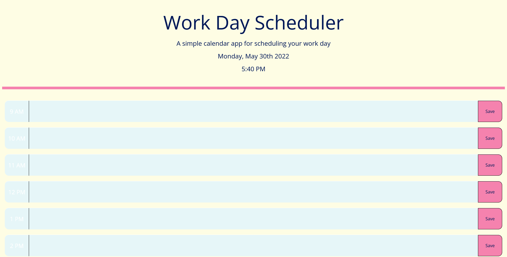

# Simple daily scheduler

**What it does**

- This application allows you to save hourly reminders to help you keep track of your busy schedule! The current day and time are displayed on the top of the page. The main body of the application is comprised of time blocks for each hour of a standard work day. The current hour of the day is displayed in light blue (#8bd3dd), while past hours are displayed in a brighter color and future time blocks appear darker.

**Step-by-Step instructions**

- To use is application, simply click on a time block and type in whatever reminder you need. Then, click the "Save" button on the right side of that time block to save the reminder to your local storage. Once saved, the reminders will stay where you put them, even if you close the webpage.

**A screenshot of the application**

**Links**
Website: https://love-ivy.github.io/ILW5Schedule/
GitHub Repository: https://github.com/Love-Ivy/ILW5Schedule

**Technologies Used**

- html
- css
- javascript
- Font Awesome
- Google Fonts
- moment.js

**Author**
Created by Ivy Lovegood
